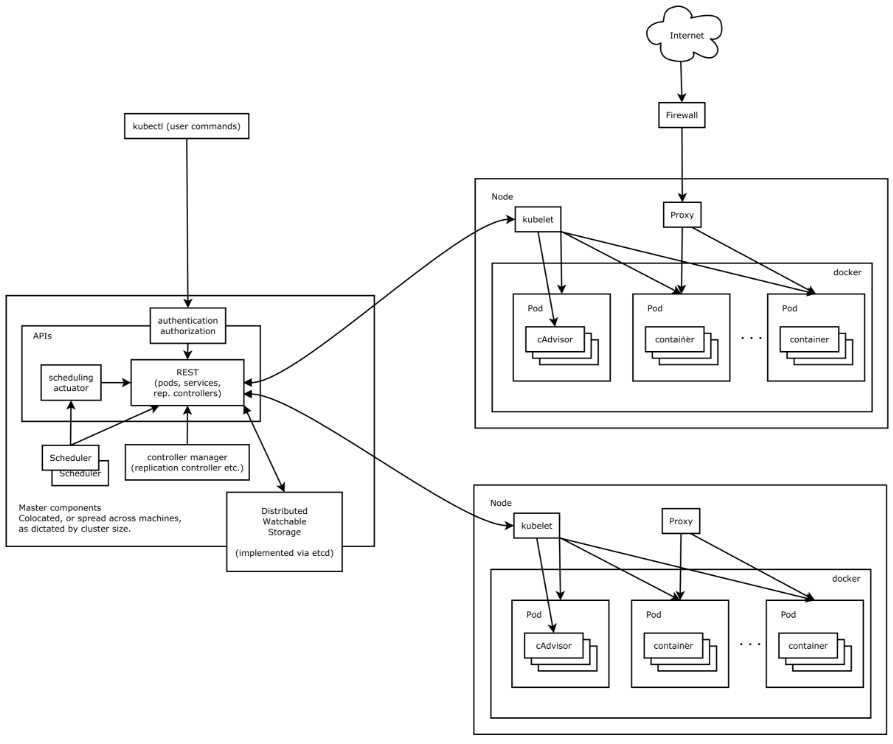

# Kubernetes用途

`Kubernetes`用于管理多种平台上的容器化应用，让容器应用的部署、维护、规划和更新更加高效简洁。

## 架构图

### 核心组件和Add-ons

### 分层架构

* 生态系统(Ecosystem)：建立在接口层(Interface Layer)之上的集群管理的生态系统；
* 接口层(Interface Layer)：客户端SDK，Kubectl命令工具和集群区域联合(Federation)；
* 管理层(Governance Layer)：系统度量（如基础设施、容器和网络容器的度量），自动化（如自动扩展、动态Provision等）以及策略管理（RBAC、Quata、PSP和NetworkPolicy等）；
* 应用层(Application Layer)：部署（无状态应用、有状态应用、批处理任务、集群应用等）和路由（服务发现、DNS解析等）；
* 核心层(Necleus)：对外部提供Api用于构建高层的应用，对内提供插件式应用执行环境；

## 参考资料

[Kubernetes中文社区](https://www.kubernetes.org.cn/kubernetes%E8%AE%BE%E8%AE%A1%E6%9E%B6%E6%9E%84)
